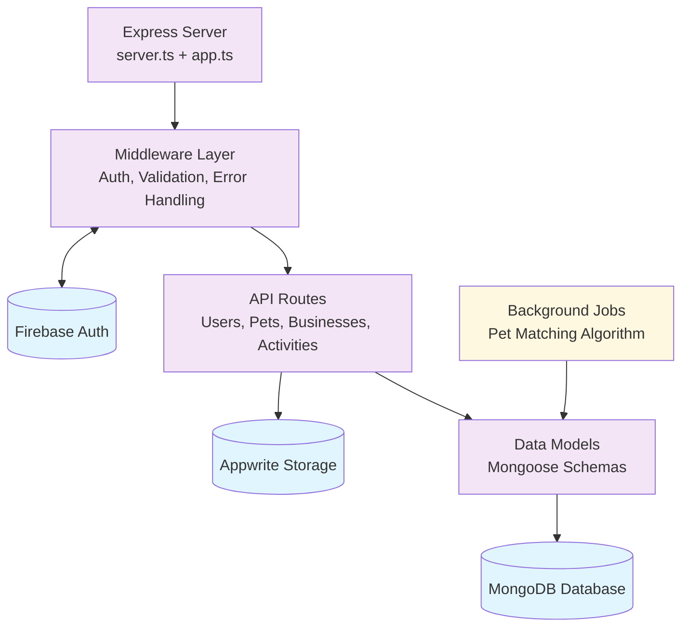
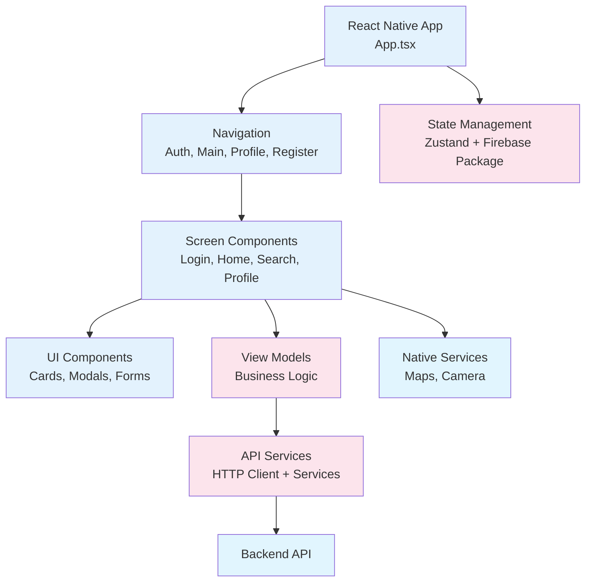

# MyPet - Pet Management & Lost Pet Recovery Platform

A comprehensive full-stack application for pet management, lost pet recovery, and pet-related business discovery. Built with React Native for mobile and Node.js/Express for the backend, featuring advanced matching algorithms, real-time notifications, and multi-language support.

## 🚀 Project Overview

MyPet is a sophisticated pet management platform that helps pet owners:

- **Register and manage their pets** with detailed profiles including photos, health records, and activity tracking

- **Report lost pets** and **found pets** with location-based matching

- **Discover nearby pet services** including veterinarians, groomers, and pet stores

- **Track pet activities** and health history

- **Receive real-time notifications** for potential matches

## 🏗️ Architecture

### Backend (`FinalProjectBackEnd/`)

- **Framework**: Node.js with Express.js

- **Database**: MongoDB with Mongoose ODM

- **Authentication**: Firebase Auth

- **File Storage**: Appwriter Storage

- **API Documentation**: Swagger/OpenAPI

- **Background Jobs**: Node-cron for automated matching

- **Notifications**: Firebase Cloud Messaging (FCM)

### Frontend (`FinalProjectFrontEnd/`)

- **Framework**: React Native 0.80.2

- **Navigation**: React Navigation v7

- **State Management**: Zustand

- **UI Library**: React Native Paper

- **Internationalization**: i18next with RTL support

- **Maps**: React Native Maps

- **Image Handling**: React Native Image Crop Picker

## 📊 System Architecture & Data Flow

### Backend Architecture & Data Flow



### Frontend Architecture & Data Flow



## 🎯 Key Features

### 🐾 Pet Management

- **Pet Registration**: Multi-step registration with photos, breed, age, and health information

- **Activity Tracking**: Log feeding, medication, exercise, grooming, and health activities

- **Health History**: Track vaccinations, vet visits, and medical records

- **Location Services**: GPS-based location tracking for pets

### 🔍 Lost & Found System

- **Smart Matching Algorithm**: Advanced algorithm that matches lost and found pets based on:

- Species compatibility

- Breed similarity

- Physical characteristics (fur color, eye color)

- Age proximity

- Geographic proximity

- Location-based scoring with configurable radius

- **Real-time Notifications**: Instant alerts when potential matches are found

- **Location-based Search**: Find pets within specified radius using geospatial queries

### 🏢 Business Discovery

- **Service Directory**: Find veterinarians, groomers, pet stores, and other pet services

- **Location-based Search**: Discover nearby businesses with distance calculations

- **Reviews & Ratings**: User-generated reviews and ratings system

- **Business Profiles**: Detailed business information with photos and services

### 🌍 Internationalization

- **Multi-language Support**: English and Hebrew with RTL layout support

- **Dynamic Language Switching**: Real-time language changes without app restart

- **RTL Layout Management**: Automatic layout direction handling for RTL languages

## 🔧 Technical Highlights

### Advanced Matching Algorithm

The core matching system uses a sophisticated scoring algorithm:

```typescript


// Key matching factors with weighted scores


- Species  match: Required (blocker  if  different)


- Breed  similarity: 4  points (exact) / 2  points (partial)


- Fur  color  match: 3  points


- Eye  color  match: 2  points


- Age  proximity (±1  year): 2  points


- Geographic  proximity: 6  points (within 3km  radius)


```

**Location**: [`FinalProjectBackEnd/src/utils/matchAlgorithm.ts`](FinalProjectBackEnd/src/utils/matchAlgorithm.ts)

### Automated Background Processing

- **Cron Jobs**: Hourly scanning for lost/found pet matches

- **Geospatial Queries**: MongoDB 2dsphere indexes for efficient location-based searches

- **Match Threshold**: Configurable scoring threshold (default: 7 points)

**Location**: [`FinalProjectBackEnd/src/jobs/matchScanner.ts`](FinalProjectBackEnd/src/jobs/matchScanner.ts)

### RTL Support Implementation

Sophisticated RTL (Right-to-Left) language support with automatic layout direction management:

```typescript
// Automatic RTL detection and layout switching

const RTL_LANGS = ["ar", "fa", "he", "ur"];

// Handles app restart for proper RTL initialization
```

**Location**: [`FinalProjectFrontEnd/utils/rtlUtils.ts`](FinalProjectFrontEnd/utils/rtlUtils.ts)

### Custom Animations

- **Hamburger Menu Animation**: Smooth animated hamburger menu with configurable callbacks

- **Tab Icon Animations**: Dynamic tab icon animations

- **Shake Animations**: Interactive feedback animations

**Location**: [`FinalProjectFrontEnd/components/Animations/Hamburger.tsx`](FinalProjectFrontEnd/components/Animations/Hamburger.tsx)

### Comprehensive Data Models

- **Geospatial Data**: MongoDB GeoJSON Point coordinates for precise location tracking

- **Flexible Pet Schema**: Supports both lost and found pet states with detailed metadata

- **Business Integration**: Complete business management with working hours and service types

**Key Models**:

- [`FinalProjectBackEnd/src/models/Pet.ts`](FinalProjectBackEnd/src/models/Pet.ts)

- [`FinalProjectBackEnd/src/models/Business.ts`](FinalProjectBackEnd/src/models/Business.ts)

- [`FinalProjectBackEnd/src/models/User.ts`](FinalProjectBackEnd/src/models/User.ts)

## 🛠️ Development Tools

### Fake Data Generator

Comprehensive test data generation system with realistic Israeli location data:

```typescript


// Generates realistic test data including:


- 50  users  with  Israeli  phone  numbers  and  emails


- 80  pets  with  varied  species, breeds, and  locations


- 30  businesses  across  Israeli  cities


- 100+ reviews  and  activity  entries


- Geospatial  coordinates  for  major  Israeli  cities


```

**Location**: [`FinalProjectBackEnd/src/utils/fakeDataGenerator.ts`](FinalProjectBackEnd/src/utils/fakeDataGenerator.ts)

### API Documentation

- **Swagger Integration**: Complete API documentation with OpenAPI 3.0

- **Interactive Testing**: Built-in API testing interface

- **Authentication**: JWT token-based authentication

## 📱 Mobile Features

### Cross-Platform Support

- **iOS & Android**: Native platform support

- **Responsive Design**: Adaptive layouts for different screen sizes

- **Platform-specific Features**: Native camera, location services, and notifications

### User Experience

- **Dark/Light Themes**: Automatic theme switching based on system preferences

- **Gesture Navigation**: Intuitive navigation with React Navigation

- **Image Management**: Advanced image picking and cropping capabilities

- **Contact Integration**: Native contact picker for emergency contacts

## 🚀 Getting Started

### Prerequisites

- Node.js 18+

- MongoDB

- Firebase project with Authentication and Storage enabled

- React Native development environment

### Backend Setup

```bash


cd  FinalProjectBackEnd


npm  install


npm  run  start


```

### Frontend Setup

```bash


cd  FinalProjectFrontEnd


npm  install


npx  react-native  run-ios  # or run-android


```

### Generate Test Data

```bash


cd  FinalProjectBackEnd


npm  run  fake-data


```

## 📊 Database Schema

### Key Collections

- **Users**: User profiles with Firebase integration

- **Pets**: Pet profiles with geospatial data and matching results

- **Businesses**: Service providers with location and rating data

- **Reviews**: User-generated business reviews

- **ActivityEntries**: Pet activity and health tracking

### Geospatial Indexes

- `pets.location.coordinates`: 2dsphere index for location queries

- `pets.lostDetails.lastSeen.coordinates`: 2dsphere index for lost pet searches

- `pets.foundDetails.location.coordinates`: 2dsphere index for found pet searches

- `businesses.location.coordinates`: 2dsphere index for business discovery

## 🔐 Security Features

- **Firebase Authentication**: Secure user authentication

- **JWT Tokens**: Stateless authentication for API access

- **Input Validation**: Joi schema validation for all API endpoints

- **CORS Configuration**: Proper cross-origin resource sharing setup

- **Error Handling**: Comprehensive error handling and logging

## 🌟 Unique Features

1.  **Intelligent Pet Matching**: Advanced algorithm combining multiple factors for accurate lost/found pet matching

2.  **RTL Language Support**: Sophisticated RTL layout management with automatic app restart

3.  **Geospatial Queries**: Efficient location-based searches using MongoDB's geospatial capabilities

4.  **Real-time Notifications**: Instant push notifications for important events

5.  **Comprehensive Activity Tracking**: Detailed pet care logging with timestamps and metadata

6.  **Multi-language Support**: Seamless language switching with proper RTL handling

## 📈 Performance Optimizations

- **Database Indexing**: Strategic indexes for fast queries

- **Image Optimization**: Efficient image handling and storage

- **Lazy Loading**: Component-based lazy loading

- **Memory Management**: Proper cleanup and memory optimization

- **Background Processing**: Efficient cron job scheduling

## 🤝 Contributing

This is a final project demonstrating full-stack mobile development with advanced features including geospatial data, real-time notifications, and sophisticated matching algorithms.

## 📄 License

This project is part of a final academic project and is not intended for commercial use.
